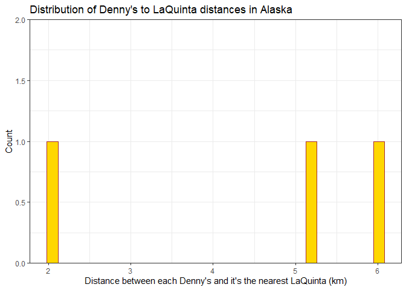
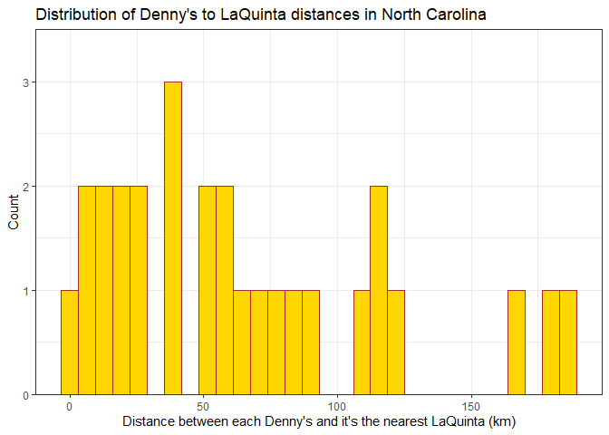
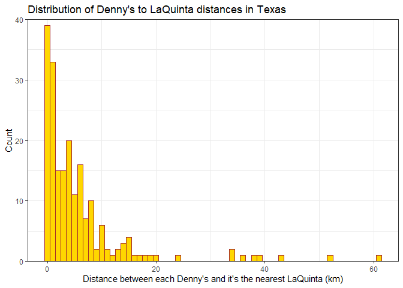
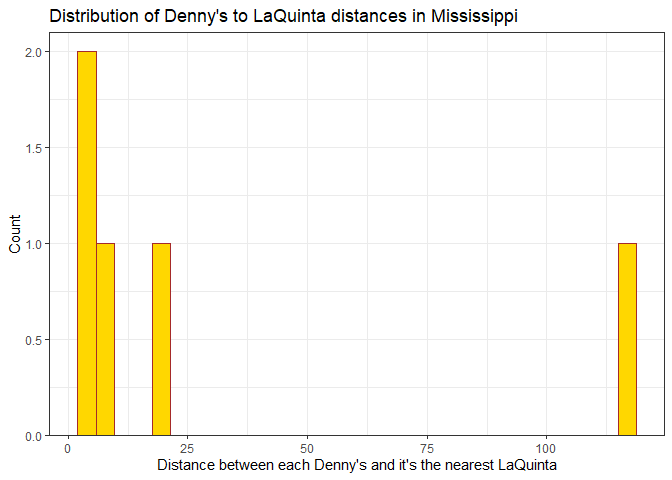

Lab 04 - La Quinta is Spanish for next to Denny’s, Pt. 2
================
Ben Hardin
2/7/2023

### Load packages and data

``` r
library(tidyverse) 
library(dsbox) 
```

``` r
states <- read_csv("data/states.csv")
dennys <- dennys
laquinta <- laquinta
```

### Exercise 1

First, let’s make a dataframe that only has Denny’s locations in Alaska.
Then, we can get the number of rows, which shows that there are 3
Denny’s in Alaska.

``` r
dennys_ak <- dennys %>%
  filter(state == "AK")
nrow(dennys_ak)
```

    ## [1] 3

### Exercise 2

Now, let’s do the same for LaQuinta locations. It seems there are 2
Laquintas in Alaska.

``` r
laquinta_ak <- laquinta %>%
  filter(state == "AK")
nrow(laquinta_ak)
```

    ## [1] 2

### Exercise 3

There are 3 Denny’s and 2 LaQuintas, so there are 3\*2 = 6 distances
between Denny’s and LaQuinta locations in Alaska. Let’s join the two
datasets we created, so we can calculate these distances.

``` r
dn_lq_ak <- full_join(dennys_ak, laquinta_ak, by = "state")
dn_lq_ak
```

    ## # A tibble: 6 × 11
    ##   address.x      city.x state zip.x longi…¹ latit…² addre…³ city.y zip.y longi…⁴
    ##   <chr>          <chr>  <chr> <chr>   <dbl>   <dbl> <chr>   <chr>  <chr>   <dbl>
    ## 1 2900 Denali    Ancho… AK    99503   -150.    61.2 3501 M… "\nAn… 99503   -150.
    ## 2 2900 Denali    Ancho… AK    99503   -150.    61.2 4920 D… "\nFa… 99709   -148.
    ## 3 3850 Debarr R… Ancho… AK    99508   -150.    61.2 3501 M… "\nAn… 99503   -150.
    ## 4 3850 Debarr R… Ancho… AK    99508   -150.    61.2 4920 D… "\nFa… 99709   -148.
    ## 5 1929 Airport … Fairb… AK    99701   -148.    64.8 3501 M… "\nAn… 99503   -150.
    ## 6 1929 Airport … Fairb… AK    99701   -148.    64.8 4920 D… "\nFa… 99709   -148.
    ## # … with 1 more variable: latitude.y <dbl>, and abbreviated variable names
    ## #   ¹​longitude.x, ²​latitude.x, ³​address.y, ⁴​longitude.y

### Exercise 4

There are 6 rows and 11 columns in the new dataset. The rows represent
the pairings of Denny’s and LaQuinta locations in Alaska. The columns
represent the variables. There is only one variable for state, because
that is the variable we joined the Denny’s and LaQuinta datasets on.
Then, we have two copies of every other location variable, with an added
letter (either x or y), which tells us whether the observation came from
the Denny’s dataset (x) or Laquinta dataset (y)

### Exercise 5

The mutate function in tidyverse lets us add a new variable to our
dataset.

``` r
haversine <- function(long1, lat1, long2, lat2, round = 3) {
  # convert to radians
  long1 = long1 * pi / 180
  lat1  = lat1  * pi / 180
  long2 = long2 * pi / 180
  lat2  = lat2  * pi / 180
  
  R = 6371 # Earth mean radius in km
  
  a = sin((lat2 - lat1)/2)^2 + cos(lat1) * cos(lat2) * sin((long2 - long1)/2)^2
  d = R * 2 * asin(sqrt(a))
  
  return( round(d,round) ) # distance in km
}
```

### Exercise 6

Alrighty, now that we have the two functions we need to do so, let’s
calculate the distances between each Denny’s and LaQuinta.

``` r
dn_lq_ak <- dn_lq_ak %>%
  mutate(distance = haversine(longitude.x, latitude.x, longitude.y, latitude.y))
```

### Exercise 7

Now we can calculate the minimum distance of a LaQuinta from each
Denny’s.

``` r
ak_mindist <- dn_lq_ak %>%
  group_by(address.x) %>%
  summarize(closest = min(distance))
```

### Exercise 8

Let’s summarize the distance between each Denny’s in Alaska and each
one’s nearest LaQuinta Inn. The average distance from a given Denny’s to
a LaQuinta Inn is 4.4. For any given Denny’s in Alaska, you are at most
about 6 km away from LaQuinta Inn; and if you’re at the luckiest Denny’s
of all, you are only 2 km away from a LaQuinta.

I made a histogram to visualize the distribution of distances from each
Denny’s and its nearest LaQuinta, rendered in beautiful Denny’s gold!
It’s not too exciting, because there are only 3 locations…

``` r
ak_mindist %>%
  summary(closest)
```

    ##   address.x            closest     
    ##  Length:3           Min.   :2.035  
    ##  Class :character   1st Qu.:3.616  
    ##  Mode  :character   Median :5.197  
    ##                     Mean   :4.410  
    ##                     3rd Qu.:5.598  
    ##                     Max.   :5.998

``` r
#getting factors ordered by closeness to LaQuinta
ak_mindist <- ak_mindist %>%
  arrange(closest) %>%
  mutate(address.x = factor(address.x, levels = address.x))
  
#plotting
ggplot(ak_mindist, aes(x = closest))+
  geom_histogram(color = "brown", fill = "gold")+
  scale_y_continuous(
    expand = c(0, 0),
    limits = c(0, 2))+
  theme_bw()+
  labs(title = "Distribution of Denny's to LaQuinta distances in Alaska", y = "Count", x = "Distance between each Denny's and it's the nearest LaQuinta (km)")
```

    ## `stat_bin()` using `bins = 30`. Pick better value with `binwidth`.

<!-- -->

### Exercise 9

Now, we repeat the whole process for North Carolina. There’s a nicer
selection of locations now, and we can see that there’s quite a spread,
where some Denny’s have a LaQuinta very nearby, but a substantial number
of Denny’s in NC are more than 100 km away from a LaQuinta.

``` r
dennys_nc <- dennys %>%
  filter(state == "NC")
nrow(dennys_nc)
```

    ## [1] 28

``` r
laquinta_nc <- laquinta %>%
  filter(state == "NC")
nrow(laquinta_nc)
```

    ## [1] 12

``` r
dn_lq_nc <- full_join(dennys_nc, laquinta_nc, by = "state")
dn_lq_nc
```

    ## # A tibble: 336 × 11
    ##    address.x     city.x state zip.x longi…¹ latit…² addre…³ city.y zip.y longi…⁴
    ##    <chr>         <chr>  <chr> <chr>   <dbl>   <dbl> <chr>   <chr>  <chr>   <dbl>
    ##  1 1 Regent Par… Ashev… NC    28806   -82.6    35.6 165 Hw… "\nBo… 28607   -81.7
    ##  2 1 Regent Par… Ashev… NC    28806   -82.6    35.6 3127 S… "\nCh… 28208   -80.9
    ##  3 1 Regent Par… Ashev… NC    28806   -82.6    35.6 4900 S… "\nCh… 28217   -80.9
    ##  4 1 Regent Par… Ashev… NC    28806   -82.6    35.6 4414 D… "\nDu… 27707   -79.0
    ##  5 1 Regent Par… Ashev… NC    28806   -82.6    35.6 1910 W… "\nDu… 27713   -78.9
    ##  6 1 Regent Par… Ashev… NC    28806   -82.6    35.6 1201 L… "\nGr… 27407   -79.9
    ##  7 1 Regent Par… Ashev… NC    28806   -82.6    35.6 1607 F… "\nCo… 28613   -81.3
    ##  8 1 Regent Par… Ashev… NC    28806   -82.6    35.6 191 Cr… "\nCa… 27518   -78.8
    ##  9 1 Regent Par… Ashev… NC    28806   -82.6    35.6 2211 S… "\nRa… 27612   -78.7
    ## 10 1 Regent Par… Ashev… NC    28806   -82.6    35.6 1001 A… "\nMo… 27560   -78.8
    ## # … with 326 more rows, 1 more variable: latitude.y <dbl>, and abbreviated
    ## #   variable names ¹​longitude.x, ²​latitude.x, ³​address.y, ⁴​longitude.y

``` r
dn_lq_nc <- dn_lq_nc %>%
  mutate(distance = haversine(longitude.x, latitude.x, longitude.y, latitude.y))
```

``` r
nc_mindist <- dn_lq_nc %>%
  group_by(address.x) %>%
  summarize(closest = min(distance))
```

``` r
nc_mindist <- nc_mindist %>%
  arrange(closest) %>%
  mutate(address.x = factor(address.x, levels = address.x))

ggplot(nc_mindist, aes(x = closest))+
  geom_histogram(color = "brown", fill = "gold")+
  scale_y_continuous(
    expand = c(0, 0),
    limits = c(0, 3.5))+
  theme_bw()+
  labs(title = "Distribution of Denny's to LaQuinta distances in North Carolina", y = "Count", x = "Distance between each Denny's and it's the nearest LaQuinta (km)")
```

    ## `stat_bin()` using `bins = 30`. Pick better value with `binwidth`.

<!-- -->

### Exercise 10

Now, we repeat the whole process for Texas. A couple of things are
striking. First, there are a ton of Denny’s in Texas! Second, a huge
chunk of the Denny’s in Texas are only a few kilometers away from a
LaQuinta, and only a tiny few Denny’s are more than 20 km from a
LaQuinta.

``` r
dennys_tx <- dennys %>%
  filter(state == "TX")
nrow(dennys_tx)
```

    ## [1] 200

``` r
laquinta_tx <- laquinta %>%
  filter(state == "TX")
nrow(laquinta_tx)
```

    ## [1] 237

``` r
dn_lq_tx <- full_join(dennys_tx, laquinta_tx, by = "state")
dn_lq_tx
```

    ## # A tibble: 47,400 × 11
    ##    address.x     city.x state zip.x longi…¹ latit…² addre…³ city.y zip.y longi…⁴
    ##    <chr>         <chr>  <chr> <chr>   <dbl>   <dbl> <chr>   <chr>  <chr>   <dbl>
    ##  1 120 East I-20 Abile… TX    79601   -99.6    32.4 3018 C… "\nAb… 79606   -99.8
    ##  2 120 East I-20 Abile… TX    79601   -99.6    32.4 3501 W… "\nAb… 79601   -99.7
    ##  3 120 East I-20 Abile… TX    79601   -99.6    32.4 14925 … "\nAd… 75254   -96.8
    ##  4 120 East I-20 Abile… TX    79601   -99.6    32.4 909 Ea… "\nAl… 78516   -98.1
    ##  5 120 East I-20 Abile… TX    79601   -99.6    32.4 2400 E… "\nAl… 78332   -98.0
    ##  6 120 East I-20 Abile… TX    79601   -99.6    32.4 1220 N… "\nAl… 75013   -96.7
    ##  7 120 East I-20 Abile… TX    79601   -99.6    32.4 1165 H… "\nAl… 76009   -97.2
    ##  8 120 East I-20 Abile… TX    79601   -99.6    32.4 880 So… "\nAl… 77511   -95.2
    ##  9 120 East I-20 Abile… TX    79601   -99.6    32.4 1708 I… "\nAm… 79103  -102. 
    ## 10 120 East I-20 Abile… TX    79601   -99.6    32.4 9305 E… "\nAm… 79118  -102. 
    ## # … with 47,390 more rows, 1 more variable: latitude.y <dbl>, and abbreviated
    ## #   variable names ¹​longitude.x, ²​latitude.x, ³​address.y, ⁴​longitude.y

``` r
dn_lq_tx <- dn_lq_tx %>%
  mutate(distance = haversine(longitude.x, latitude.x, longitude.y, latitude.y))
```

``` r
tx_mindist <- dn_lq_tx %>%
  group_by(address.x) %>%
  summarize(closest = min(distance))
```

``` r
tx_mindist <- tx_mindist %>%
  arrange(closest) %>%
  mutate(address.x = factor(address.x, levels = address.x))

ggplot(tx_mindist, aes(x = closest))+
  geom_histogram(binwidth = 1, color = "brown", fill = "gold")+
  scale_y_continuous(
    expand = c(0, 0),
    limits = c(0, 40))+
  theme_bw()+
  labs(title = "Distribution of Denny's to LaQuinta distances in Texas", y = "Count", x = "Distance between each Denny's and it's the nearest LaQuinta (km)")
```

<!-- -->

### Exercise 11

Okay, now let’s try it one more time with my home state, Mississippi.
This one is a little bit like Alaska, because there aren’t very many
Denny’s in Mississippi. Of those, it looks like a couple of them are
quite close to a LaQuinta, one of them is about 20 km away, and the last
one is more than 100 km away.

``` r
dennys_ms <- dennys %>%
  filter(state == "MS")
nrow(dennys_ms)
```

    ## [1] 5

``` r
laquinta_ms <- laquinta %>%
  filter(state == "MS")
nrow(laquinta_ms)
```

    ## [1] 12

``` r
dn_lq_ms <- full_join(dennys_ms, laquinta_ms, by = "state")
dn_lq_ms
```

    ## # A tibble: 60 × 11
    ##    address.x     city.x state zip.x longi…¹ latit…² addre…³ city.y zip.y longi…⁴
    ##    <chr>         <chr>  <chr> <chr>   <dbl>   <dbl> <chr>   <chr>  <chr>   <dbl>
    ##  1 1839 Highway… Green… MS    38701   -91.0    33.4 957 Ce… "\nBi… 39532   -88.9
    ##  2 1839 Highway… Green… MS    38701   -91.0    33.4 215 Da… "\nBr… 39042   -90.0
    ##  3 1839 Highway… Green… MS    38701   -91.0    33.4 152 So… "\nCa… 39046   -90.1
    ##  4 1839 Highway… Green… MS    38701   -91.0    33.4 109 Lu… "\nHa… 39401   -89.3
    ##  5 1839 Highway… Green… MS    38701   -91.0    33.4 721 So… "\nHo… 38637   -90.0
    ##  6 1839 Highway… Green… MS    38701   -91.0    33.4 501 So… "\nPe… 39208   -90.1
    ##  7 1839 Highway… Green… MS    38701   -91.0    33.4 593 E.… "\nJa… 39206   -90.1
    ##  8 1839 Highway… Green… MS    38701   -91.0    33.4 1400 R… "\nMe… 39301   -88.7
    ##  9 1839 Highway… Green… MS    38701   -91.0    33.4 7001 H… "\nMo… 39563   -88.5
    ## 10 1839 Highway… Green… MS    38701   -91.0    33.4 982 Hi… "\nSt… 39759   -88.8
    ## # … with 50 more rows, 1 more variable: latitude.y <dbl>, and abbreviated
    ## #   variable names ¹​longitude.x, ²​latitude.x, ³​address.y, ⁴​longitude.y

``` r
dn_lq_ms <- dn_lq_ms %>%
  mutate(distance = haversine(longitude.x, latitude.x, longitude.y, latitude.y))
```

``` r
ms_mindist <- dn_lq_ms %>%
  group_by(address.x) %>%
  summarize(closest = min(distance))
```

``` r
ms_mindist <- ms_mindist %>%
  arrange(closest) %>%
  mutate(address.x = factor(address.x, levels = address.x))

ggplot(ms_mindist, aes(x = closest))+
  geom_histogram(color = "brown", fill = "gold")+
  scale_y_continuous(
    expand = c(0, 0),
    limit = c(0, 2.1))+
  theme_bw()+
  labs(title = "Distribution of Denny's to LaQuinta distances in Mississippi", y = "Count", x = "Distance between each Denny's and it's the nearest LaQuinta")
```

    ## `stat_bin()` using `bins = 30`. Pick better value with `binwidth`.

<!-- -->

### Exercise 12

Mitch Hedberg’s joke seems to hold the most true for Texas, because so
many Denny’s are within 5 km of the nearest LaQuinta! Alaska is a close
second, except there are so few Denny’s there that it seems kind of
irrelevant.
